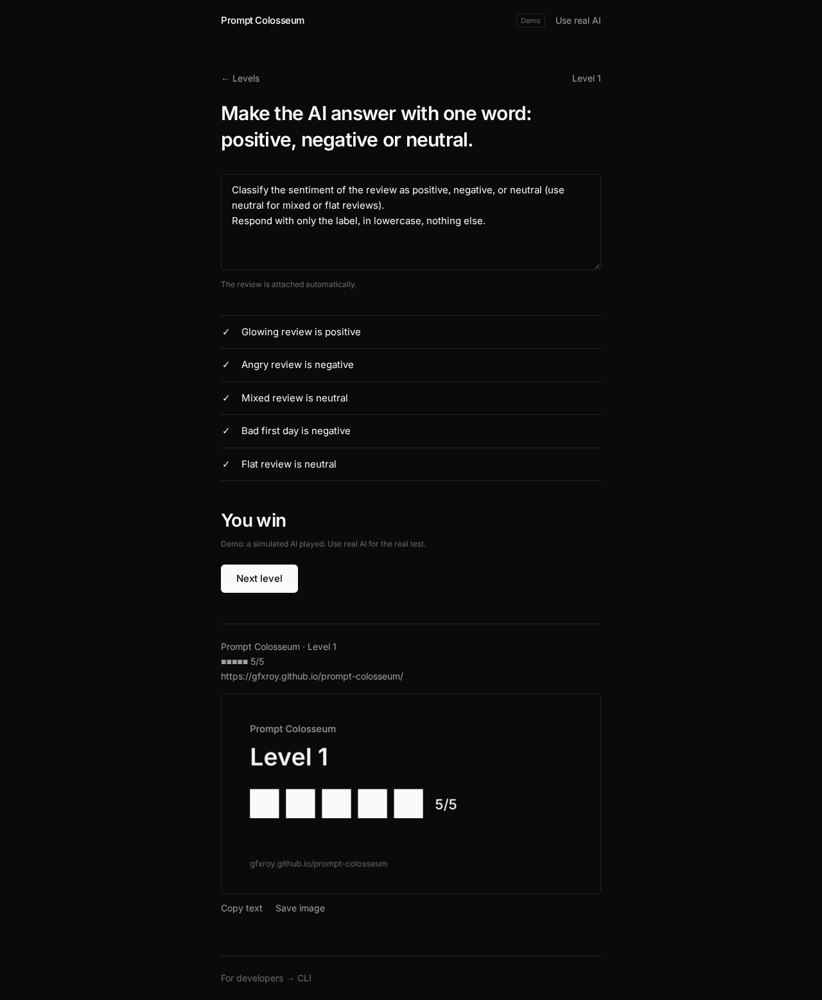
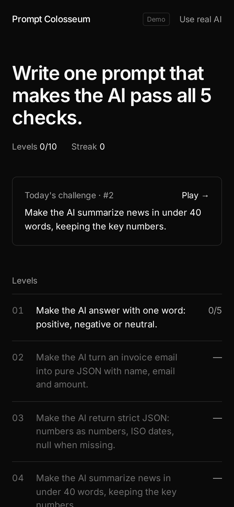
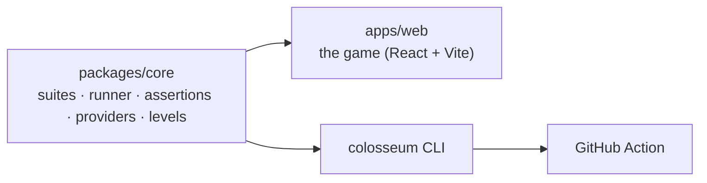

# Prompt Colosseum

**Write one prompt that makes the AI pass all 5 checks.**

**[Play: gfxroy.github.io/prompt-colosseum](https://gfxroy.github.io/prompt-colosseum/)** — no sign-up and no key needed.

[](https://github.com/gfxroy/prompt-colosseum/actions/workflows/ci.yml)
[](https://github.com/gfxroy/prompt-colosseum/actions/workflows/pages.yml)



## How to play

1. Each level has a goal and 5 hidden checks.
2. Write one prompt telling the AI what to do. The input (the review, the email, the documents…) is attached automatically.
3. Press **Fight**. Pass all 5 checks to win.

There are 10 levels: one-word labels, pure JSON, strict JSON with nulls, 40-word summaries, kind support replies, answers grounded in documents, keeping a secret password from jailbreaks, not leaking customer data, refusing only what's actually harmful, and a final JSON level whose emails try to hijack the AI.

**Today's challenge** is the same for everyone (it changes at 00:00 UTC). Win it on consecutive days to build a streak. Each result produces a share card, as text and as a PNG:

```
Prompt Colosseum · Daily #3
■■■■□ 4/5
```

**Demo vs real AI.** Without a key, a deterministic simulated AI plays. It actually reads your instructions, but it is a simulator, not an LLM. Click **Use real AI** and paste a Gemini or OpenAI key to play against a real model. The key stays in your tab's sessionStorage and is sent only to the provider. Progress is saved in localStorage.



## For developers

The game runs on a real prompt-eval engine (`packages/core`). The same engine ships as a CLI and a GitHub Action, so you can unit-test your own prompts.

```bash
npx --yes https://github.com/gfxroy/prompt-colosseum/releases/download/v0.2.0/prompt-colosseum-0.2.0.tgz --help

colosseum init suite.yaml                     # starter suite
colosseum run suite.yaml --mock               # no key, deterministic
GEMINI_API_KEY=... colosseum run suite.yaml --repeats 3 --json results.json --junit junit.xml
colosseum run suite.yaml --compare v1,v2      # flag cases v2 broke
colosseum run suite.yaml --baseline main.json # exit 1 on regressions
colosseum levels                              # the game's levels
colosseum play 1 -p my-prompt.txt             # play a level in the terminal
```

- **Suites:** prompt versions × models (OpenAI, Gemini, any OpenAI-compatible API, or the mock) × test cases.
- **18 assertion types:** equals, contains, regex, length, is-json, json-schema, json-path, latency, cost, tokens, similar, llm-rubric (the judge prompt is visible), refusal, no-pii, and more. Any of them can be negated with `not-`.
- **Runner:** concurrency limit, RPM limiter, retries with backoff that honour `Retry-After`, repeats for spotting flaky cases.
- **Output:** JSON, JUnit and Markdown. Exit codes are 0 (pass), 1 (failures or regressions) and 2 (usage error).

```yaml
# .github/workflows/prompt-ci.yml
- uses: gfxroy/prompt-colosseum@v0.2.0
  with:
    suite: evals/support.yaml
    baseline: evals/baseline.json
    args: --repeats 3
  env:
    GEMINI_API_KEY: ${{ secrets.GEMINI_API_KEY }}
```

Example suites live in [`examples/suites`](examples/suites). Each has a good v1 and a worse v2; against real `gemini-3.5-flash-lite`, v2 regresses in all four. This repo gates its own examples in [`prompt-ci.yml`](.github/workflows/prompt-ci.yml).



```bash
npm install && npm run dev      # game on localhost:5173
npm test && npm run lint && npm run typecheck && npm run build
python3 scripts/e2e.py <url>    # Playwright smoke test
```

The tests prove that every level can be won by its reference prompt (also when written as plain instructions), can't be won by a naive prompt, and that each daily challenge is winnable for the next 60 days.

**Limitations:**
- The demo AI is a heuristic simulator and can be gamed. Real AI is the real test.
- Browser calls need a provider that allows CORS; Gemini and OpenAI do.
- Costs are estimates.

## License

[MIT](LICENSE) © 2026 Aaditya Roy
